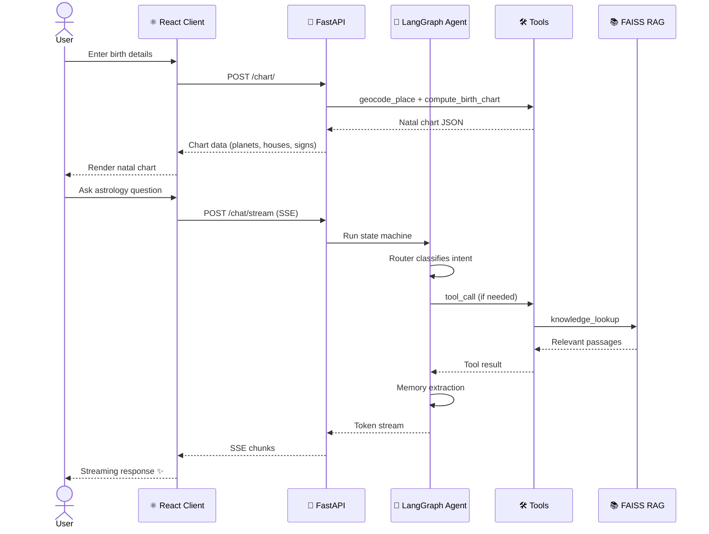
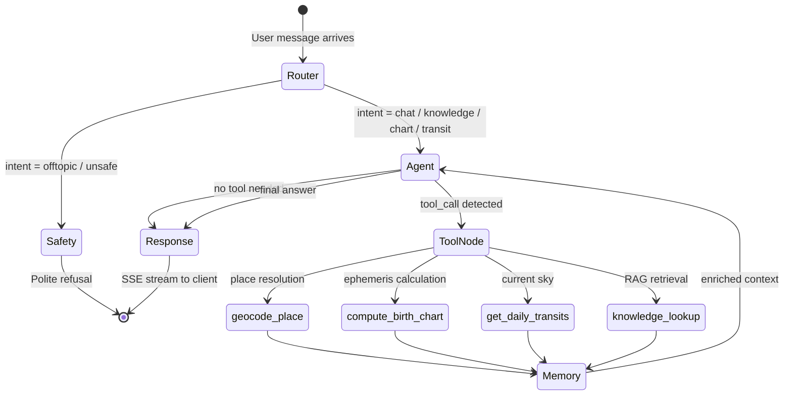
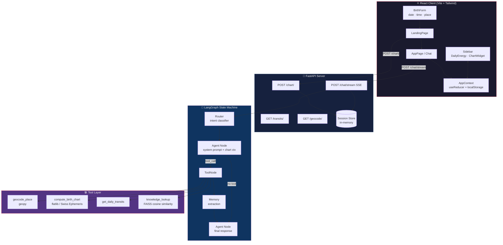
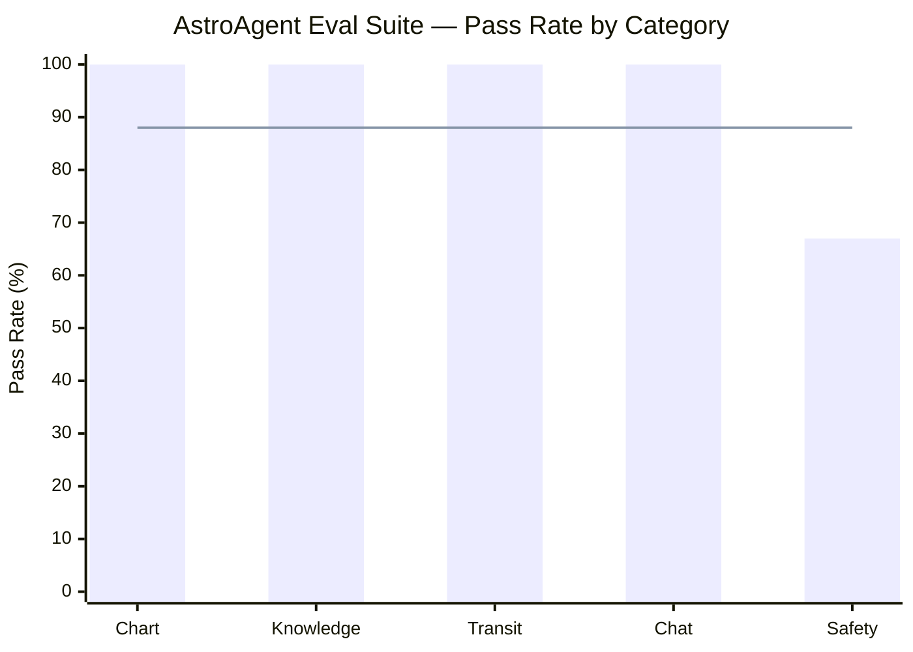
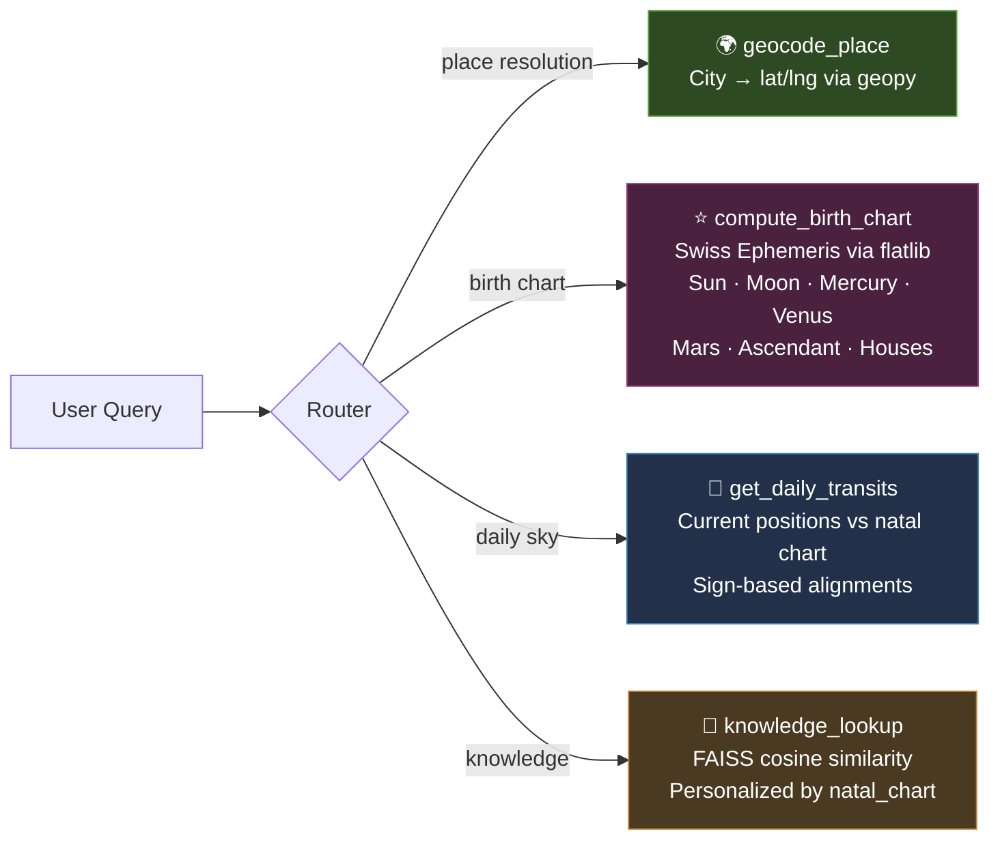
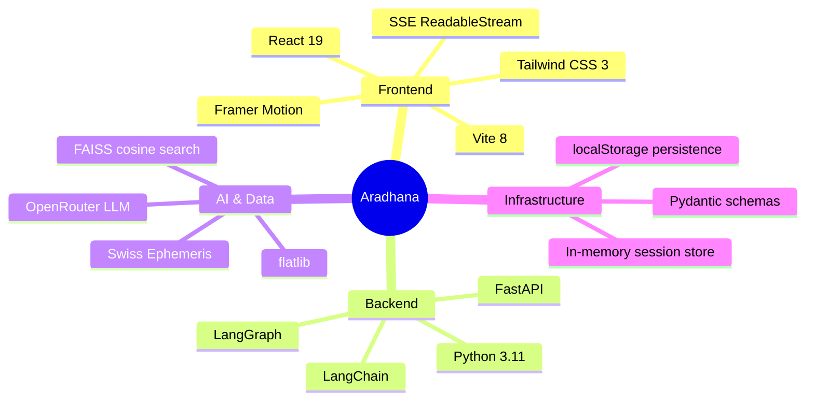

<div align="center">

# 🔭 Aradhana — AstroAgent

**An AI-powered astrology assistant. Born from the stars. Built with LangGraph.**

[](https://www.python.org/)
[](https://react.dev/)
[](https://fastapi.tiangolo.com/)
[](https://www.langchain.com/langgraph)
[](LICENSE)

<br/>

> *Enter your birth details. Receive your natal chart. Ask the cosmos anything.*

<br/>

```
  ♈ ♉ ♊ ♋ ♌ ♍ ♎ ♏ ♐ ♑ ♒ ♓
       The sky at your birth — decoded by AI
  ♈ ♉ ♊ ♋ ♌ ♍ ♎ ♏ ♐ ♑ ♒ ♓
```

[**✨ Live Demo**](#) · [**📖 Docs**](#setup) · [**🐛 Report Bug**](#) · [**💡 Request Feature**](#)

</div>

---

## ✨ What is Aradhana?

Aradhana is a full-stack AI astrology assistant that combines:

- **Swiss Ephemeris precision** — the same engine used by professional astrologers
- **LangGraph intelligence** — a multi-node state machine that routes, reasons, and retrieves
- **RAG knowledge base** — a FAISS-indexed corpus of astrology wisdom for grounded answers
- **Real-time streaming** — SSE-powered responses that feel alive
- **Session memory** — the agent remembers your chart and adapts every answer to *you*

Enter your birth date, time, and place. Get a complete natal chart. Then just... ask.

---

## 🎬 How It Works

### Request Lifecycle



---

### Agent State Machine



---

### Full Architecture



---

## 📊 Evaluation Results



| Category | Pass Rate | Notes |
|----------|-----------|-------|
| 🗺️ Chart | **100%** | Natal chart computation |
| 📚 Knowledge | **100%** | RAG-powered astrology Q&A |
| 🌍 Transit | **100%** | Daily planetary alignments |
| 💬 Chat | **100%** | Conversational handling |
| 🛡️ Safety | **67%** | Needs prompt hardening |
| **Overall** | **88%** | Avg latency: **2.8s** |

---

## 🛠️ Tools Reference



---

## 📁 Project Structure

```
aradhana/
├── client/                          # ⚛️ React frontend
│   └── src/
│       ├── components/
│       │   ├── cards/               # DailyEnergyCard, SafetyNoticeCard
│       │   ├── chart/               # ChartSidebarWidget, PlanetRow
│       │   ├── chat/                # ChatArea, InputBar, MessageBubble
│       │   ├── landing/             # HeroSection, BirthForm
│       │   └── ui/                  # Button, Input, Spinner, DatePicker
│       ├── context/AppContext.jsx   # Global state (useReducer + localStorage)
│       ├── hooks/                   # useChart, useChat, useTransits
│       └── pages/                   # LandingPage, AppPage
│
└── server/                          # 🐍 Python backend
    ├── app/
    │   ├── api/                     # Routes: chat, chart, geocode, transits
    │   ├── core/llm.py              # LLM client (OpenRouter / OpenAI)
    │   ├── graph/
    │   │   ├── graph.py             # StateGraph definition
    │   │   ├── state.py             # AstroState TypedDict
    │   │   ├── router.py            # Intent classification
    │   │   ├── memory.py            # Post-tool memory extraction
    │   │   └── session_store.py     # In-memory sessions
    │   ├── rag/vector_store.py      # FAISS index loader
    │   └── tools/                   # LangChain tool definitions
    ├── evals/                       # 🧪 Evaluation harness (30 golden prompts)
    ├── data/                        # Ephemeris files
    ├── faiss_index/                 # Pre-built FAISS index
    └── main.py                      # FastAPI entry point
```

---

## 🚀 Setup

### Prerequisites

| Requirement | Version |
|------------|---------|
| Python | 3.11+ |
| Node.js | 20+ |
| OpenRouter API key | (or any OpenAI-compatible endpoint) |

### 1. Clone

```bash
git clone https://github.com/your-username/aradhana.git
cd aradhana
```

### 2. Backend

```bash
cd server

# Create and activate virtual environment
python -m venv venv
source venv/bin/activate        # Linux/Mac
# venv\Scripts\activate         # Windows

# Install dependencies
pip install -r requirements.txt

# Configure environment
cp .env.example .env
# Set OPENAI_API_KEY and MODEL_NAME in .env

# Download ephemeris data (if not present)
python scripts/download_ephemeris.py

# Start server
uvicorn main:app --reload --port 8000
```

### 3. Frontend

```bash
cd client

npm install
npm run dev
# → http://localhost:5173  (proxied to :8000)
```

---

## 🧪 Evaluation

```bash
# Full suite (30 prompts across all categories)
python -m server.evals.run_eval

# Smoke test — 1 prompt per category
python -m server.evals.run_eval --quick

# Single category
python -m server.evals.run_eval --category knowledge
```

See [`server/evals/EVALUATION.md`](server/evals/EVALUATION.md) for full methodology and results analysis.

---

## 🧱 Tech Stack



---

## 🗺️ Roadmap

- [ ] 🔐 Persistent session storage (Redis / PostgreSQL)
- [ ] 📅 Synastry charts (compatibility between two charts)
- [ ] 🌍 Multi-language support
- [ ] 📱 Mobile-first redesign
- [ ] 🔔 Daily transit push notifications
- [ ] 🎨 Visual natal chart renderer (SVG)
- [ ] 🧠 Improve safety guardrails (target: 95%+)

---

## 🤝 Contributing

Contributions, issues, and feature requests are welcome!

1. Fork the repo
2. Create your feature branch (`git checkout -b feature/saturn-return`)
3. Commit your changes (`git commit -m 'Add Saturn return calculator'`)
4. Push to the branch (`git push origin feature/saturn-return`)
5. Open a Pull Request

---

## 📜 License

Distributed under the MIT License. See `LICENSE` for more information.

---

<div align="center">

**Made with ♥ and stardust**

*"The stars incline, they do not compel."*

[](https://github.com/your-username/aradhana)

</div>